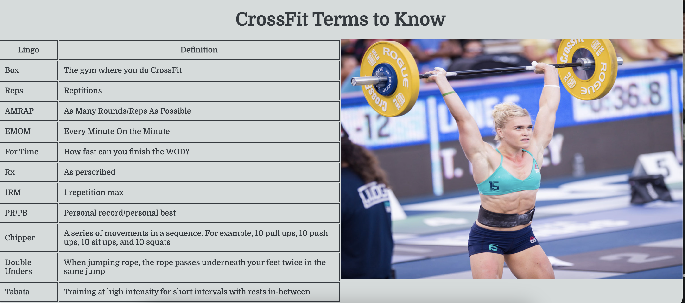

# WHAT IS CROSSFIT?

## DESIGN

This project was created to provide information on what CrossFit is and to provide sample workouts - WODs - to gain interest. The audience for this project is anyone who wants more information on what CrossFit is and/or who is wanting to be more healthy and fit in general. However, more specifically, I am targeting women by using many images of women. By providing sample WODs and terms to know, someone can go into any CrossFit class and already have some background knowledge on what to expect.

## FEATURES

### Languages Used

HTML
CSS

### Colors

I chose a gray theme chosen from the color palette on coolors. I wanted to keep it simple and wanted the images and the text to pop, so I kept a simple, light gray background. For the header and the footer, I used a dark gray to contrast the background. I used white text in the logo to make it pop more, in keeping with the theme.

## Navigation Bar

Featured on all pages, the full responsive navigation bar includes links to the Home Page, Terms and Wods, and Contact Us pages to allow for easy navigation. The dark color contrasts with the light color of the background to make it easy to read. This section allows the user to easily navigate from page to page across all devices without having to revert back to the previous page via the ‘back’ button. I also change the navigation menu for smaller screens so that it is easy to use. 

## The Landing Page

The Header - The header is a light color that contrasts the dark background color to make it easy to read. It explains the purpose of the website. It asks a question - "What is CrossFit?" which will be explained throughout the website. In addition, I use a font that is easy to read.

The landing page is broken up into three sections. All sections are meant to be short, simple concepts that are essential in CrossFit. The first section provides a defintion of what CrossFit is so that the user can understand what elements are included in CrossFit. The image to the right, is of Katrin Davíðsdóttir, who has been a winner twice of the CrossFit Games. 

The second section is an explanation of an important concept to understand - WOD. It is essential in CrossFit to understand what this means, as this is the basis of all workouts that one will execute. The image here is of a woman doing a back squat to help show excersises that are commonly part of WODs.

The third section is a list of benefits that one will aquire if he/she/they joins the CrossFit community. Again, another basic movement for the image is to demonstrate exerceises that will be part of your normal workout routine, should you want to join a class.

I end with "Want to Learn More" hoping that the user will be intrigued and want to learn more; and therefore, click the links at the bottom of the page and my other pages to want to learn more about CrossFit.

I specifically have chosen all female atheletes here as I want to promote more involement of female atheletes in general. This is due to most of the media coverage in sports and of atheletes in general being male dominated. I want women to know that this sport is for them too. They don't need to think that it's too tough - that it is for everyone. It is also for all levels of fitness as anyone can do CrossFit and scale the workouts if necessary.

The footer, which is the same on all pages, is taken from the Love Running Project. It includes link to social media sites and allows easy naviagation for the user, as all links open in a new tab. The footer encourages the user to find out more about CrossFit.

## Terms & WODs Page

I start with a table of terms to know on the left. I feel that it is important to understand some terms because if a person will join a CrossFit class, he/she/they will not feel so lost if they don't understand the terminology. The terms provide some basic explanations that a person will experience in any CrossFit class. On the right, I provide an image of Katrin Davíðsdóttir during one of her competitions as motivation for the audience.

Next I provide some Famous WODs as examples of what workouts one is likely to experience in a CrossFit class. I got the motivation for this from the Love Running Project, in which they provided times and running locations. However, here I have provided Famous WODs instead to give the user a sense of some of the WODs they will encounter. Again, I use a lot of female names/workouts to motivate women to want to join. The image in the background is of a kettlebell and will often be used during CrossFit classes. Additionally, I use fontawesome icons to show strength for the workouts.

## Contact Us Page

This page provides the user a form in which he/she/they can contact us if wanting more information about CrossFit. It also uses a radio button to ask the user why he/she/they are interested in CrossFit, so that we can provide information accordingly. It asks to provide first name, last name, and email address. I also have included an image of a barbell, which is a dark image to keep with the theme.

## Thank You Page

This page was created with the intent of the user knowing that their information successfully went through and thank them for contacting us.

## Testing

I have tested that my projects works on various browsers - Safari, Chrome, and FireFox.
I also have confirmed that my project is responsive by using the devtools toolbar.
I confirm that all sections, heading, footer, and navigation are readable and easy to understand.
I confirm that my form will only accept required information and that it works appropiately. 

## Validator Testing

HTML
* No errors were returned when passing through the official W3C validator
CSS
* No errors were returned when passing through the official Jigsaw validator
Accessibility
* I confirm easy user accessibility by running it through lighthouse in dev tools

## Unfixed Bugs

No unfixed bugs

## Deployment

For this project I used GitHub

The live link can be found here - (What is CrossFit?) [ https://jaimilit.github.io/Portfolio-One/]

## Credits

### Content
Text for the index page is taken from Shape at https://www.shape.com/what-is-crossfit-training-7096578
Text for the benefits was also taken from Shape at https://www.shape.com/fitness/tips/health-fitness-benefits-crossfit
The terms for the table were selected from this website https://www.crossfitsalemoor.com/crossfit/crossfit-terminology/
Famous WODs were taken from several websites http://gymlion.com/10-most-popular-crossfit-workouts/ and
https://www.getsweatgo.com/workout/guides/best-crossfit-workouts-17
The icons in the footer and the dumbell for the Famous WODs were taken from Font Awesome
Footer and Famous WODs sections ideas were taken from Love Running Project
Navigation menu also inspired by Love Running Project

### Media

Images were taken from the following:

Pexels:
The barbell for the Contact Us page was taken from Pexels- https://www.pexels.com/photo/black-barbell-685530/
The barbell for the Benefits section was taken from Pexels - https://www.pexels.com/photo/woman-in-black-sportswear-lifting-a-barbell-7674497/
The Thank You image was also taken from Pexels - https://www.pexels.com/photo/gold-thank-you-text-with-gold-glitters-7248762/

Other images:
The Kettlebell for Famous WODs section - https://www.dreamstime.com/kettlebell-crossfit-training-man-banner-panorama-image196069779
First image for Definiton section was taken from here - https://www.boxrox.com/katrin-davidsdottir-wise-words-and-action-photos-from-the-icelandic-crossfit-queen-2/
For the image on the Terms and WODs page with the table - https://www.womenshealthmag.com/fitness/g19933478/fittest-woman-on-earth-workout/
the woman on the wods section was taken from https://www.istockphoto.com/se/foto/young-woman-resting-a-heavy-barbell-on-her-shoulders-gm483546998-71017309